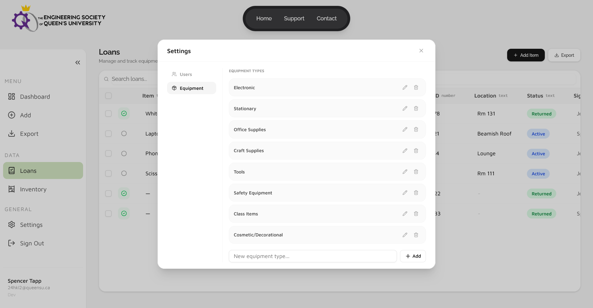

# 887D iCons IMS User Manual

Welcome to the iCons IMS user manual. This manual is designed to bring a user up to speed on the basic functionalities of the app, while assuming no prior experience with similar software.
If you are looking on a guide on a specific task/operation, please refer to it's corresponding section. If we have missed something, please contact us using the "[Contact Us](https://icons-ims.vercel.app/contact)" page of the application. (You will need to be [signed in](#11-access))

## 1. App Basics

### 1.1 Access

The application can be accessed at the url [https://icons-ims.vercel.app/](https://icons-ims.vercel.app/)
The team suggests you use a laptop or computer to access the software as not all menus have been tested and optimized for mobile.
On the landing page you will be presented with a 'launch' button which leads to the sign in page. Here you should use your **queens** credentials.

Once signed in, you will have access to the application.

### 1.2 App Tour

#### 1.2.1 Navigation

On the left side of the screen, the application has a folding navigation bar. As shown below.

You can use this to cycle between the different windows of the application. You can also press the shown arrow button to hide the navbar and expand screen space for the selected view.

#### 1.2.2 Dashboard

The base view of the app is the [dashboard](https://icons-ims.vercel.app/main/dashboard). On this page you can do all basic rental and inventory related operations.

To select between the 'inventory' and 'loans' modes of the dashboard, use their respective buttons.

The dashboard has multiple views for functionality and user preference. They can be selected using the highlighted buttons below.

1) **'List' or 'Spreadsheet' view.** This view is most akin to the old Excel based system. Like that system, you can simply click the desired field to edit it. For more info see [INSERT LINK HERE](#).
2) **'Card' or 'Grid' view.** This view is less structured than the spreadsheet view, however is just as functional. When editing entries in this view, clicking an item will show a form allowing for easy editing. For more information see [INSERT LINK HERE]().
3) **'Analytic' view.** Is used to view the inbuilt analytic tools. For more information see [INSERT LINK HERE]().

#### 1.2.3 Data Pages

The two data pages are designed to be alternate ways of viewing and editing stored data. They are accessed using the two highlighted navbar entries in the following image.

They are functionally the same as the spreadsheet view of the dashboard, just without unrelated panels. Once again, data can be edited by clicking the desired field. For mor information see [INSERT LINK HERE]().

#### 1.2.4 Settings

The settings modal can be accessed from the navbar entry highlighted in the image below.

.

When clicked, the settings modal will appear. It is shown below.

It can be used by operators to edit and add **Insert Link Here**[equipment types](link) or by admin to edit [user permissions](link).

