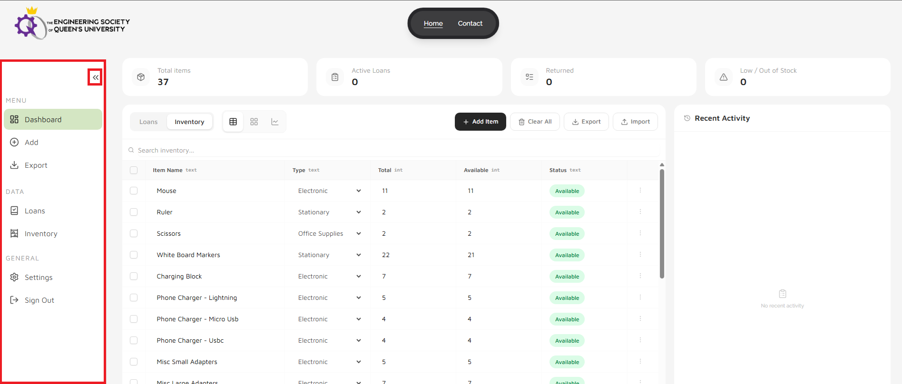
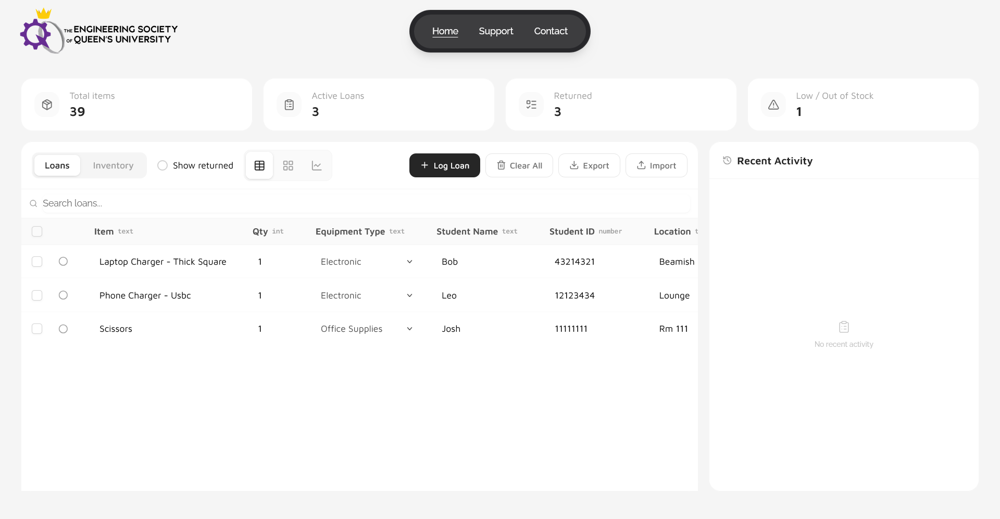
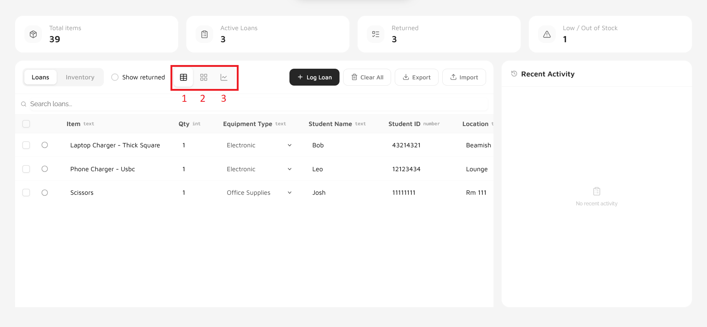
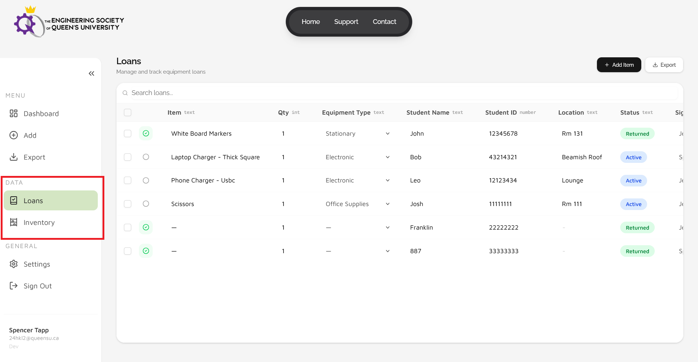
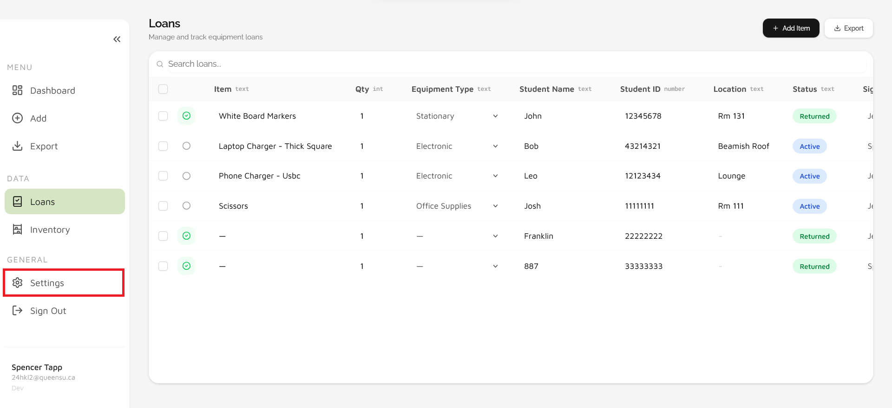
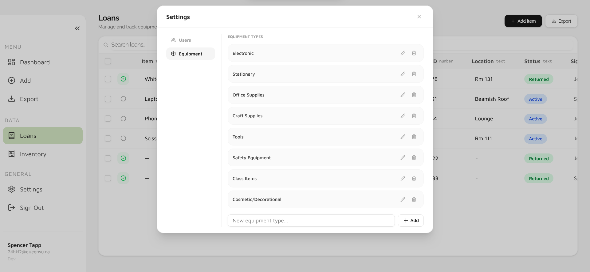
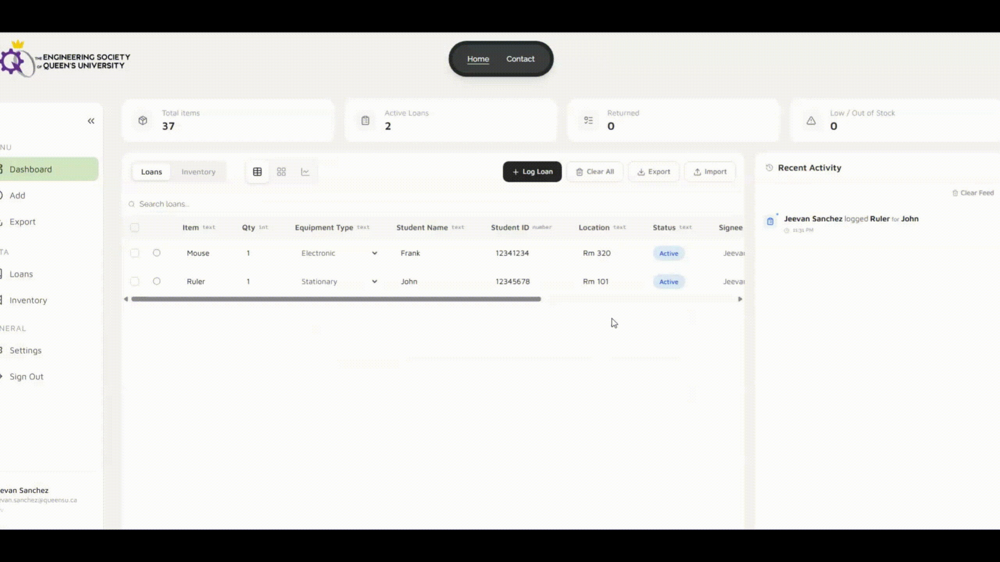
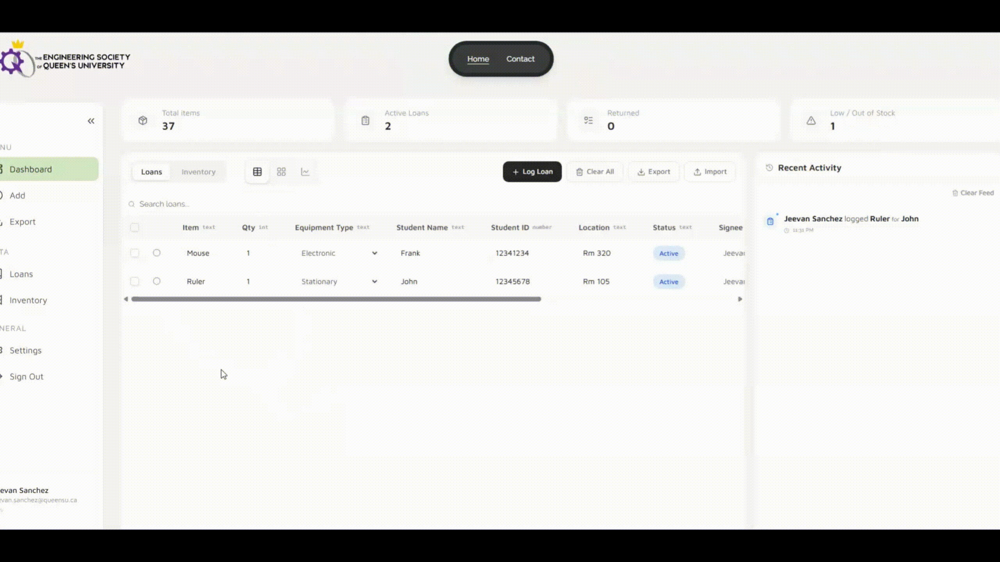
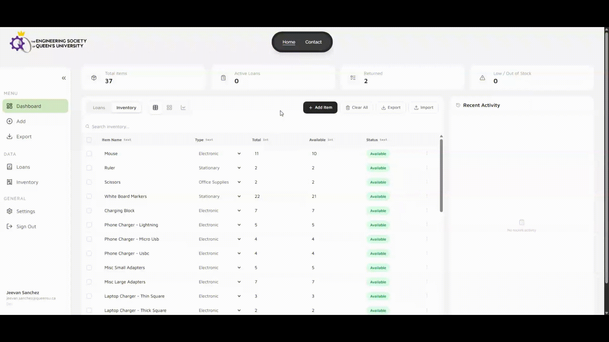
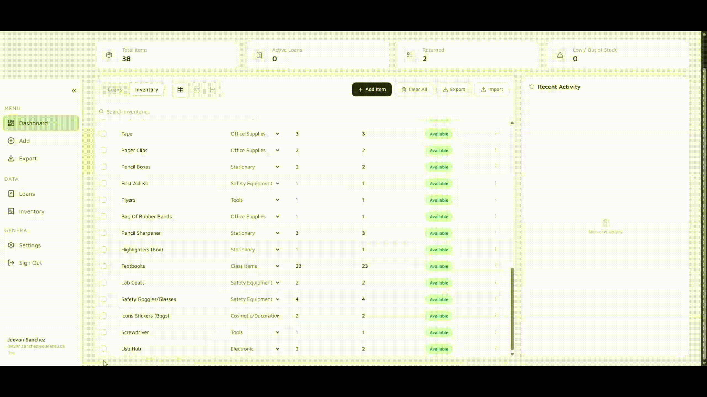

# iCons IMS User Manual

<strong>Table of Contents</strong>

- [iCons IMS User Manual](#icons-ims-user-manual)
  - [Overview](#overview)
  - [1. Getting Started](#1-getting-started)
  - [2. System Information](#2-system-information)
    - [2.1 System Description](#21-system-description)
    - [2.2 Data Organization](#22-data-organization)
    - [2.3 Loan Data Legend](#23-loan-data-legend)
    - [2.4 Stock Data Legend](#24-stock-data-legend)
    - [2.5 Authentication](#25-authentication)
  - [3. App Basics](#3-app-basics)
    - [3.1 Access](#31-access)
    - [3.2 App Tour](#32-app-tour)
      - [3.2.1 Navigation](#321-navigation)
      - [3.2.2 Dashboard](#322-dashboard)
      - [3.2.3 Data Pages](#323-data-pages)
      - [3.2.4 Settings](#324-settings)
  - [4. Common Operations](#4-common-operations)
    - [4.1 Inventory Management](#41-inventory-management)
      - [4.1.1 Logging a Rental](#411-logging-a-rental)
      - [4.1.2 Editing a Rental](#412-editing-a-rental)
      - [4.1.3 Logging a Returned Item](#413-logging-a-returned-item)
      - [4.1.4 Adding a New Item](#414-adding-a-new-item)
      - [4.1.5 Removing an Item](#415-removing-an-item)
    - [4.2 Data Migration](#42-data-migration)
      - [4.2.1 Importing Data](#421-importing-data)
      - [4.2.2 Exporting Data](#422-exporting-data)
    - [4.3 Customization](#43-customization)
      - [4.3.1 Adding and Editing Custom Equipment Types](#431-adding-and-editing-custom-equipment-types)
  - [5. Technical Information](#5-technical-information)
    - [5.1 Frameworks and Technologies](#51-frameworks-and-technologies)
    - [5.2 GitHub Repository](#52-github-repository)
  - [6. Closing Remarks](#6-closing-remarks)

## Overview
Welcome to the iCons IMS user manual.

This manual provides guidance on common operations, application navigation, account access and initial setup, as well as explanations of key features and workflows.

For topics not covered here, please contact the team through the [Contact Us](https://icons-ims.vercel.app/contact) page after signing in.

## 1. Getting Started

Follow these steps to get up and running quickly:

1. **Navigate to the app** at [https://icons-ims.vercel.app](https://icons-ims.vercel.app/).
2. **Select Launch** on the landing page to begin the login process.
3. **Sign in** using your Queen's University email ending in `@queensu.ca`.
4. **Familiarize yourself with your role:**
   - **iCon / Operator** — Access to all inventory and loan operations, excluding user management and clearing records.
   - **Admin / Head iCon** — Full access to all app functionality, including user management and clearing records.
5. **Head to the Dashboard** from the sidebar to begin logging rentals or checking inventory.
6. **Explore Settings** to configure custom equipment types (Operators) or manage users (Admins).

For a full walkthrough of the interface, see [Section 3: App Basics](#3-app-basics). For step-by-step operation guides, see [Section 4: Common Operations](#4-common-operations).

## 2. System Information

### 2.1 System Description
The Inventory Management System (IMS) is a web-based tool for managing iCons inventory and handling equipment loans. It is fully cloud-based and leverages Microsoft OAuth with the Queen's University tenant for secure authentication.

### 2.2 Data Organization
The IMS organizes data with two primary tables and several intermediate tables. It separates loan and stock data, and uses linked data fields to automatically sync updates across tables.
- For instance, a loan of a single item will be removed from that item's stock count.

### 2.3 Loan Data Legend
This table defines the fields used in the Loan Data structure.

| Field | Description |
|------|-------------|
| `Name` | Name of the item being loaned. |
| `Quantity` | Quantity of the item being loaned. |
| `Equipment Type` | Category of the item (e.g., stationary, electronic, etc.) |
| `Student Name` | Full name of the student renting equipment. |
| `Student Number` | 8-digit student ID number of the student renting equipment. |
| `Location` | Location associated with the loan record. |
| `Status` | Current status of the loan (e.g., active, returned), derived from timestamps. |
| `Signee` | Name of the staff member who processed or signed off the loan. |
| `Time Loaned` | Timestamp when the item was loaned out. |
| `Time Returned` | Timestamp when the item was returned. |

### 2.4 Stock Data Legend
This table defines the fields used in the Stock Data structure.

| Field | Description |
|------|-------------|
| `Name` | Name of the inventory item. |
| `Equipment Type` | Category of the item (e.g., stationary, electronic, etc.) |
| `Total` | Total number of units owned for this item. |
| `Available` | Number of units currently available (not on loan). |
| `Status` | Current availability status of the item (e.g., in stock, low stock, out of stock), derived from stock values. |

### 2.5 Authentication
The IMS uses Microsoft OAuth with the Queen's University tenant `@queensu.ca` for authentication.

Admitted staff can log in with their Queen's emails to access the app.

Admins can manage users within the app, including adding new users, modifying roles, and removing users.

## 3. App Basics

### 3.1 Access

The application is accessed at [https://icons-ims.vercel.app](https://icons-ims.vercel.app/).

Once loaded, select the **Launch** button to start the app and log in.
- Ensure you are using your Queen's email ending in `@queensu.ca`.

*Figure 1: App landing page*

Once signed in, you will have access to the system.

**A note on Role-Based Access:**
- If you are accessing the app as an iCon/Operator, you have access to all functionality besides user management and clearing records.
- As an Admin/Head iCon you have access to all of the app's functionality.

### 3.2 App Tour

#### 3.2.1 Navigation

A sidebar for navigation is featured on the left side of the screen; highlighted in Figure 2. The app's primary features are accessed here.

Additionally, a top navigation bar is used to access the **Contact** page.

*Figure 2: Highlighted navigation sidebar*

You can also press the shown arrow button to hide the sidebar and expand screen space for the selected view.

#### 3.2.2 Dashboard

The base view of the app is the [Dashboard](https://icons-ims.vercel.app/main/dashboard). On this page you can perform all basic rental and inventory related operations.

*Figure 3: Dashboard with table view of loan data*

To select between the `inventory` and `loans` modes of the dashboard, use the tab switcher in the table's header.

The dashboard has multiple views for functionality and user preference. They can be selected using the highlighted buttons below.

*Figure 4: Showcase of data multi-view feature*

1. **Table (Spreadsheet) View**
   This view provides a user-friendly version of a traditional spreadsheet interface. Edits are made directly within table cells.
2. **Card (Grid) View**
   This view presents data as individual cards for improved readability. Selecting a card opens a form that allows for easy editing of the entry.
3. **Analytic View**
   This view provides access to built-in analytics tools through chart-based visualizations.

#### 3.2.3 Data Pages

The two data pages are alternate ways of viewing and editing stored data. They are accessed using the two highlighted sidebar sections in Figure 5.

*Figure 5: Highlight of data pages in sidebar*

They function identically to the spreadsheet view of the dashboard, but without unrelated panels. Entry updates are performed in the same way as in the dashboard, within each respective view.

#### 3.2.4 Settings

The settings window can be accessed from the sidebar section highlighted in Figure 6.

*Figure 6: Highlight of settings dialog in sidebar*

Once selected, the settings window will open.

In this window, operators can add or edit custom equipment types. Admins can add new users, change existing user roles, and remove users.

*Figure 7: Settings window*

## 4. Common Operations
The following section provides short tutorial GIFs of example operations through the IMS.

### 4.1 Inventory Management
Inventory management can be executed in either data view.

#### 4.1.1 Logging a Rental

#### 4.1.2 Editing a Rental
Rental data can be edited both inline in table view or form-based in grid view.

#### 4.1.3 Logging a Returned Item

#### 4.1.4 Adding a New Item

#### 4.1.5 Removing an Item
This is an **Admin** operation.

### 4.2 Data Migration

#### 4.2.1 Importing Data
For data imports, select the `Import` button in the table view for the desired data, or use the sidebar.

Imported files must be of `CSV` format and have rows matching the system's.

#### 4.2.2 Exporting Data
All data can be exported as a CSV file with optional filtering.

### 4.3 Customization

#### 4.3.1 Adding and Editing Custom Equipment Types

## 5. Technical Information

### 5.1 Frameworks and Technologies
The IMS leverages the following frameworks:

**Frontend**
- React JS
- TailwindCSS
- React Tanstack
- shadCN
- Framer Motion

**Backend**
- Node JS
- Supabase

### 5.2 GitHub Repository
All code and documentation can be found in the project [GitHub repository]().

## 6. Closing Remarks

The IMS was developed by Group 887D for the Winter 2026 APSC 103 project.

For support or feedback, please reach out to the team through the application's [Contact Us](https://icons-ims.vercel.app/contact) page after signing in.

Alternatively, you can email the team directly at [Group887D@outlook.com](mailto:Group887D@outlook.com).

We hope this system provides a reliable and efficient solution for managing inventory and loans.